# CS 4111 Introduction to Parallel Computing <br> HW4: Bitcoin Miner (CUDA)  

## Name, Student ID
- Name: 王元廷
- Student ID: 106062119  

## Implementation & Parallelization Techniques  

In this assignment, I modified the sequential version of code and convert it into a parallel version using OpenMP and CUDA. I would explain the keypoint of my implementation following the procedure section of sequential code (similar to p15 in *HW4.pdf*).  

### Step 1. Read Input  
I did not modify the coding logic in the I/O part since it seems to be always sequential, there is no more efficient ways to handle it or they are not feasible for me.  

The only thing I do is to move it to the ```main``` function because I had modified the ```solve``` function to be a kernel function. Since the input can only be read once and all kernel functions would share the same input (block information), there is no need and is more intelligent to move this part to ```main``` and let CPU to do the task.  

### Step 2. Calculate Merkle Root  
This part of code is originally in ```solve``` function in the sequential version. Again, I moved it to ```main``` and keep it as a host function. The reason why I choose to let CPU do the task is because I think the task is not heavy enough for GPU to do. There are only a few transcations in most datasets, if we convert it to be handled in a kernel function, there will be much communication cost.  
> Note: I did not do experiment on it. Yet, CPU did not run for a significantly long time in this function.  

Although I let CPU to do the task, I have tried to make it more efficient by using **OpenMP** to distribute the for loop on calculating the address of merkle branch.  

### Step 3. Decode Find Out the Target Difficulty  
This part is kept in ```solve``` (kernel) function in my implementation. Since every worker needs to know the target difficulty and that it does not take long time to calculate. I simply make all workers calculate by themselves as local variables.  

### Step 4. Proof-of-Work: Find Nonce
This is the main parallel section of the program. Since this part is independent and is entirely a job that does not require much communication unless you find the target nonce, I distribute the works statically that every thread has a designated range of nonces to try. The only communication flag is ```___device___ bool flag```, which would only be false when someone find a target nonce. So, the logic is quite simple: do your job until you find a target nonce or someone found it and raise the flag (to false).  

To make this part of code able the perform concurrently in a kernel function, I have made all functions which will be used to be both **\_\_host\_\_** and **\_\_device\_\_** ( not only \_\_device\_\_ since some functions are also used in calculating merkle root, which is a host function). Also, all variables that will be used in this part is copied into the kernel function in advance using ```cudaMemcpyAsync()```. After a worker finds the nonce the raise the flag (to false), only ```ans_cuda``` which is set to be ```block.nonce``` will be copied back to the host for CPU to write.  

## Experiments of various combinations of the number of blocks & threads  
I have tried the following combinations and recorded the execution time:  
| block x thread | testcase 00 | testcase 01 | testcase 02 | testcase 03 |
|----------------|-------------|-------------|-------------|-------------|
|640x32|25.8161|66.8161|1.82485|10.54|
|640x64|17.66|32.7903|1.2999|5.47785|
|1280x16|19.5876|51.4497|1.30588|7.56998|
|1280x32|18.2875|35.3564|**0.91367**|5.26826|
|320x64|26.9197|68.8197|1.87652|10.6844|
|320x128|18.9491|34.824|1.34041|5.35344|
|20x256|15.6041|39.2305|4.46654|2.08276|
|160x256|**11.1814**|**20.8962**|1.02685|**3.61493**|

For the screen captures of each result, please refer to the **Appendix** (at the end of this report).

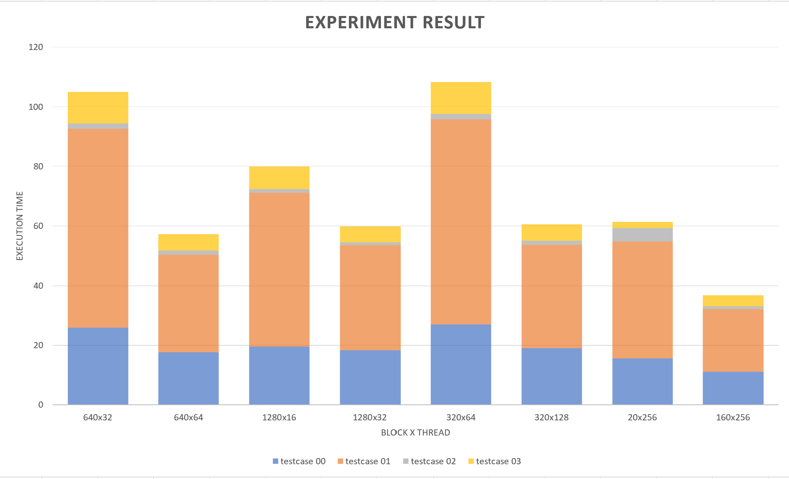
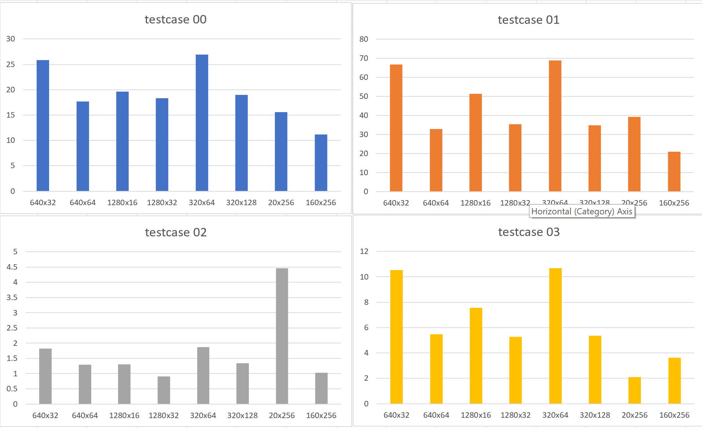

Therefore, I picked the combination <<<160,256>>> to be my configuration of number of blocks & threads.  

## Appendix: Screenshots of ```nvprof``` results of every combinations  

- \# block: 640, \# thread: 32, testcase 00:  
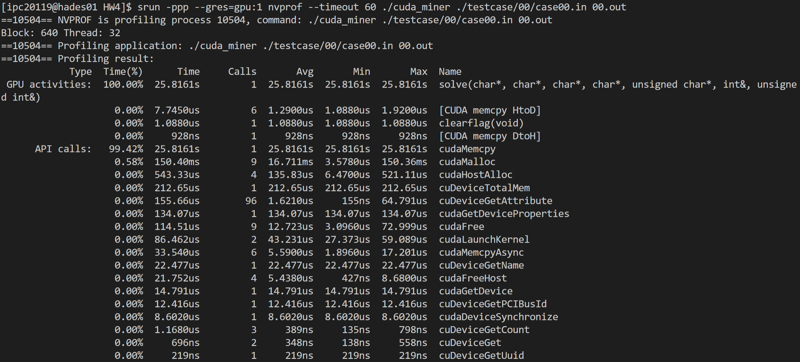   
- \# block: 640, \# thread: 32, testcase 01:  
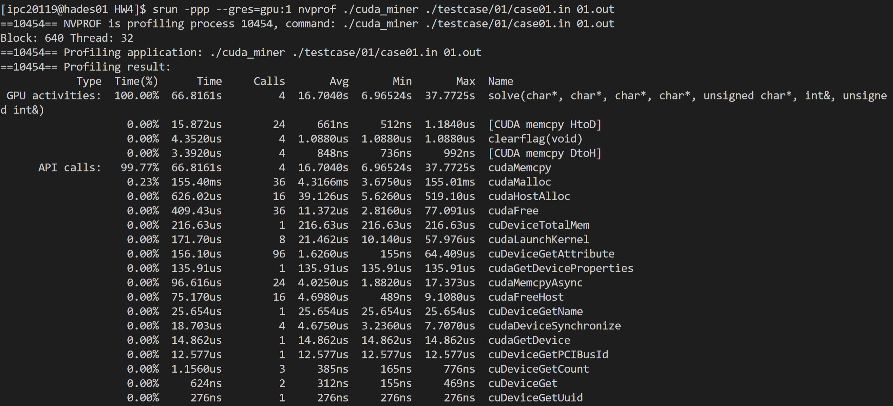    
- \# block: 640, \# thread: 32, testcase 02:  
  
- \# block: 640, \# thread: 32, testcase 03:  
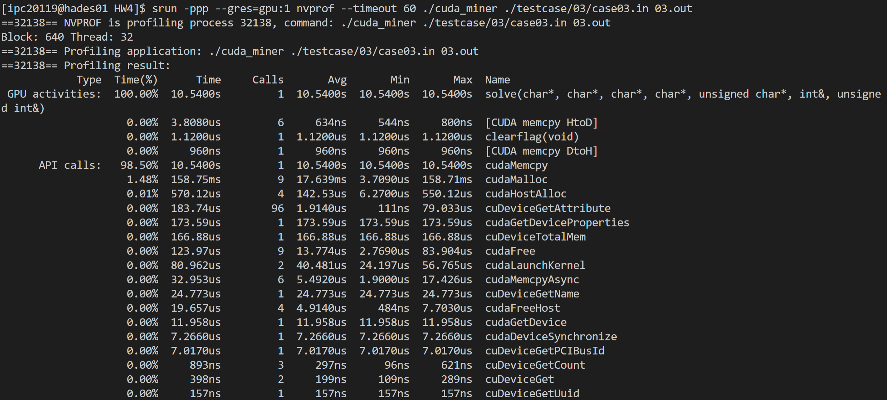  

- \# block: 640, \# thread: 64, testcase 00:  
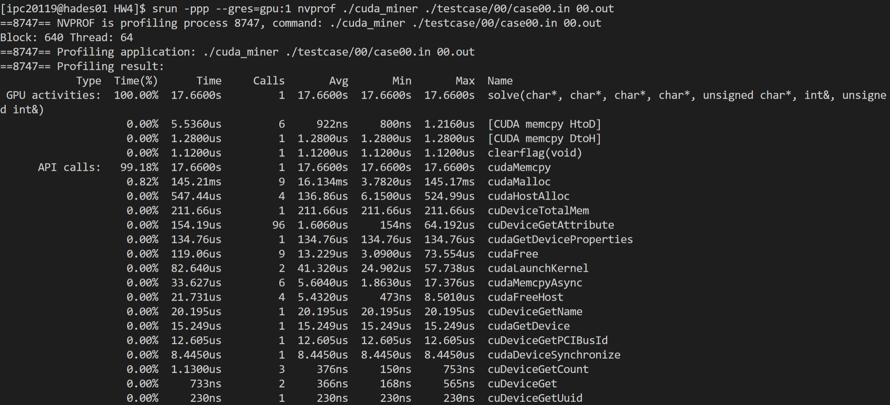  
- \# block: 640, \# thread: 64, testcase 01:  
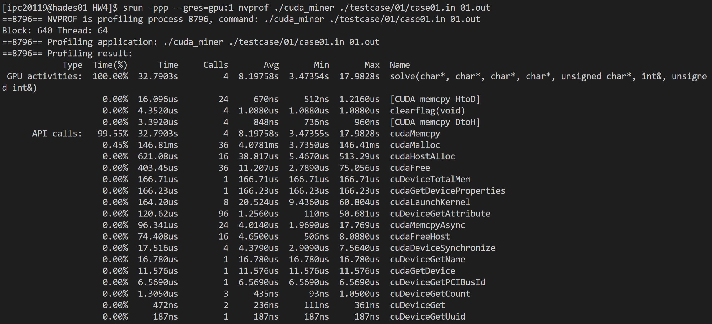  
- \# block: 640, \# thread: 64, testcase 02:  
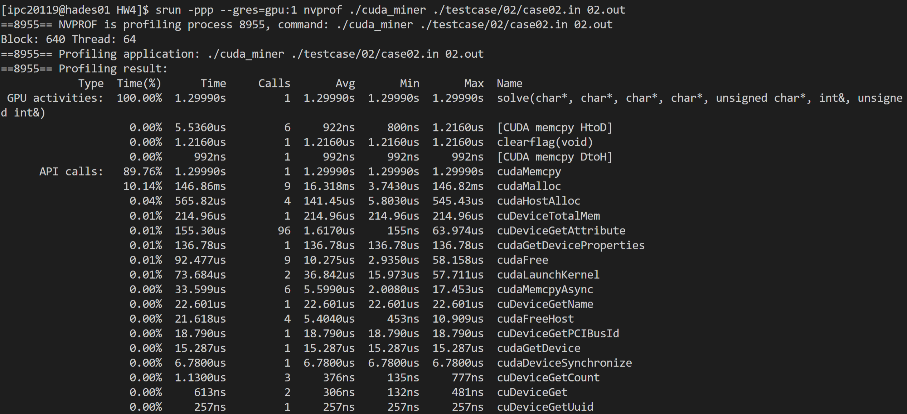  
- \# block: 640, \# thread: 64, testcase 03:  
  

- \# block: 1280, \# thread: 16, testcase 00:  
  
- \# block: 1280, \# thread: 16, testcase 01:  
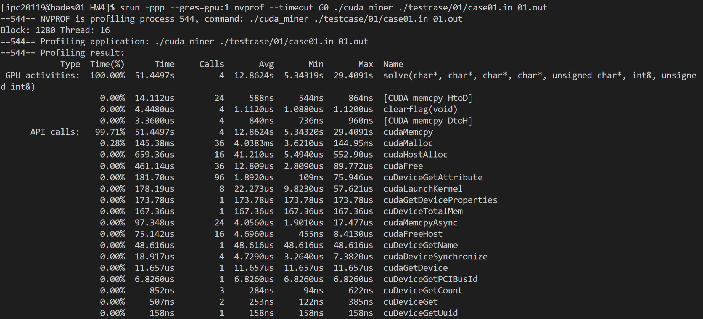  
- \# block: 1280, \# thread: 16, testcase 02:  
  
- \# block: 1280, \# thread: 16, testcase 03:  
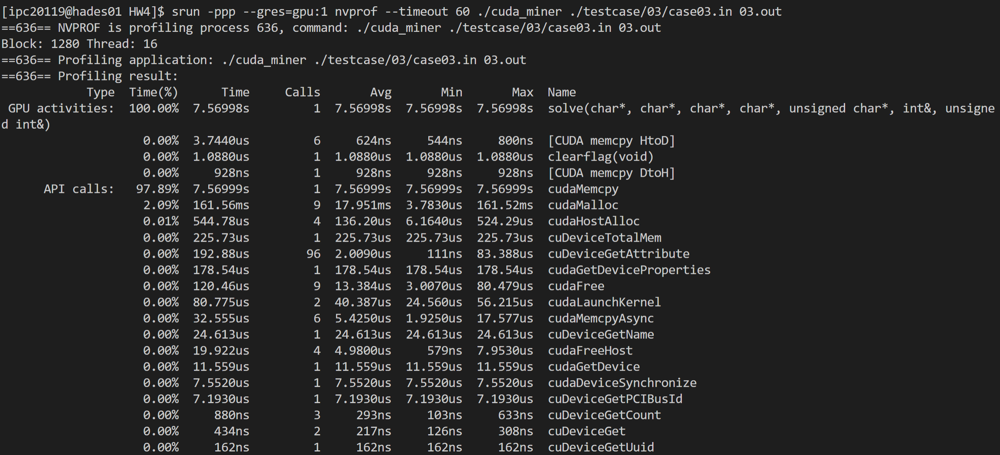  

- \# block: 1280, \# thread: 32, testcase 00:  
  
- \# block: 1280, \# thread: 32, testcase 01:  
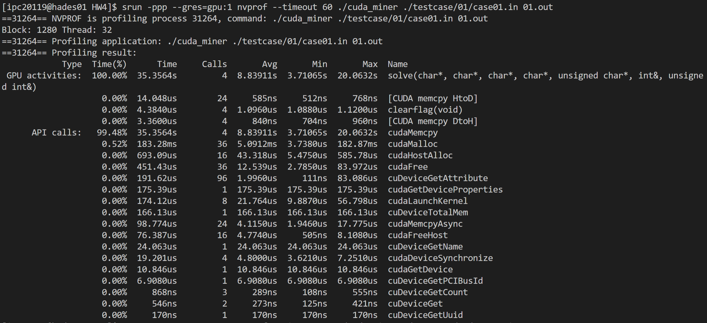  
- \# block: 1280, \# thread: 32, testcase 02:  
  
- \# block: 1280, \# thread: 32, testcase 03:  
  

- \# block: 320, \# thread: 64, testcase 00:  
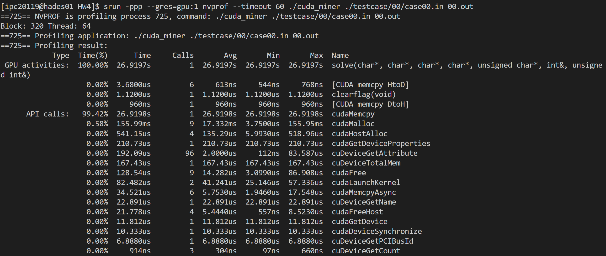  
- \# block: 320, \# thread: 64, testcase 01:  
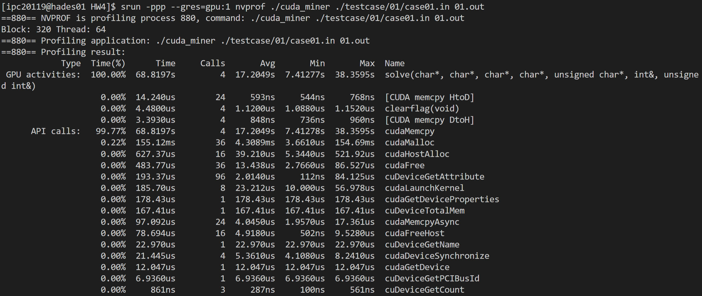  
- \# block: 320, \# thread: 64, testcase 02:  
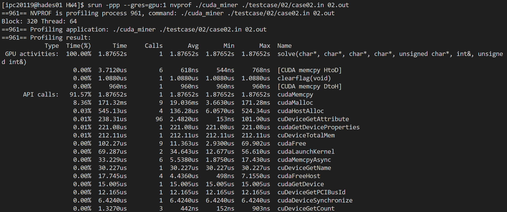  
- \# block: 320, \# thread: 64, testcase 03:  
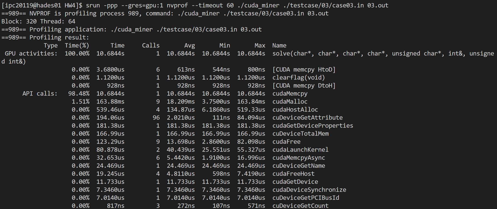   

- \# block: 320, \# thread: 128, testcase 00:  
  
- \# block: 320, \# thread: 128, testcase 01:  
  
- \# block: 320, \# thread: 128, testcase 02:  
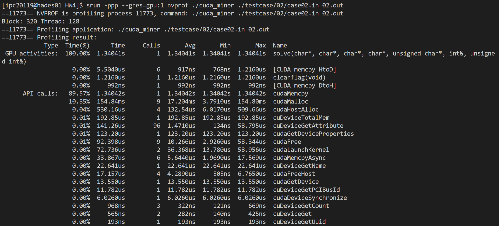  
- \# block: 320, \# thread: 128, testcase 03:  
  

- \# block: 20, \# thread: 256, testcase 00:  
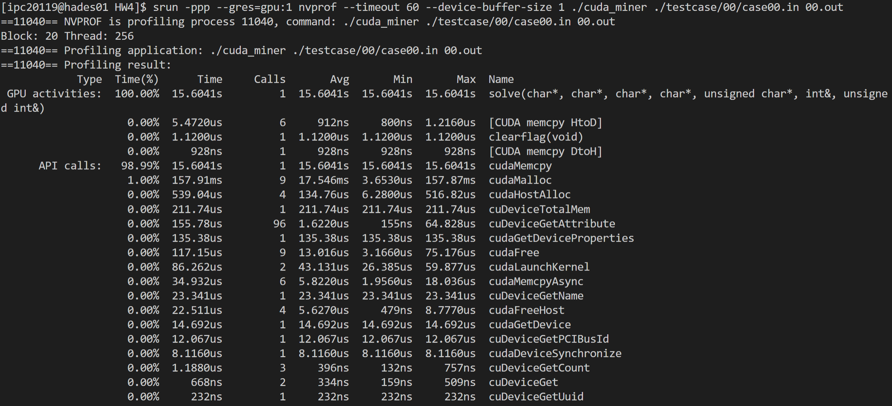  
- \# block: 20, \# thread: 256, testcase 01:  
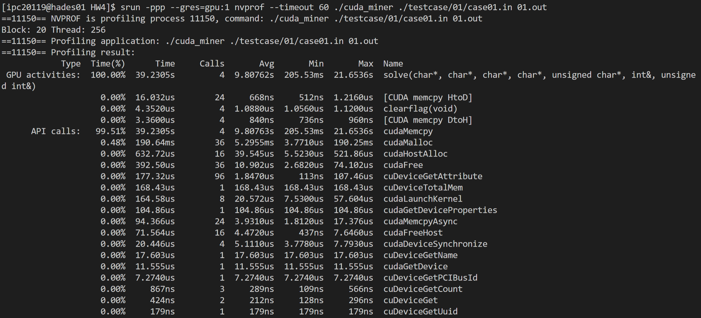  
- \# block: 20, \# thread: 256, testcase 02:  
  
- \# block: 20, \# thread: 256, testcase 03:  
  

- \# block: 160, \# thread: 256, testcase 00:  
  
- \# block: 160, \# thread: 256, testcase 01:  
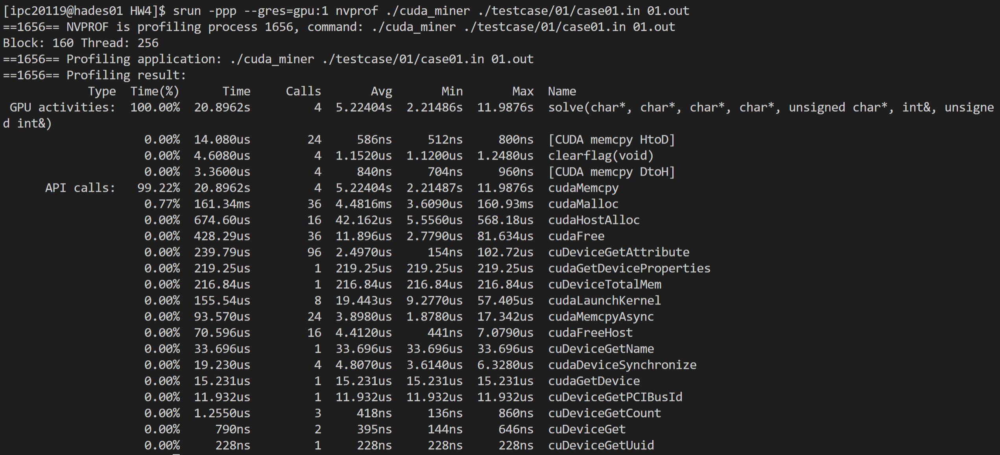  
- \# block: 160, \# thread: 256, testcase 02:  
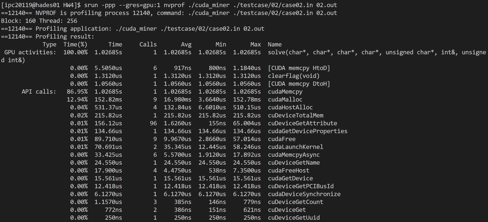  
- \# block: 160, \# thread: 256, testcase 03:  
  